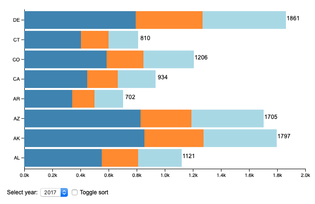

# D3 horizontal stacked bar chart

A horizontal version of [this vertical bar chart](https://bl.ocks.org/LemoNode/5a64865728c6059ed89388b5f83d6b67).

This chart animations the sorting of the bars, which is something that is not common in many charting libraries.

[](https://lonnygomes.github.io/d3-horizontal-stacked-bar-chart/)

## Usage

This proof of concept example is built using [ParcelJS](https://parceljs.org) and can be run locally with the following commands:

```bash
npm install
npm start
```
